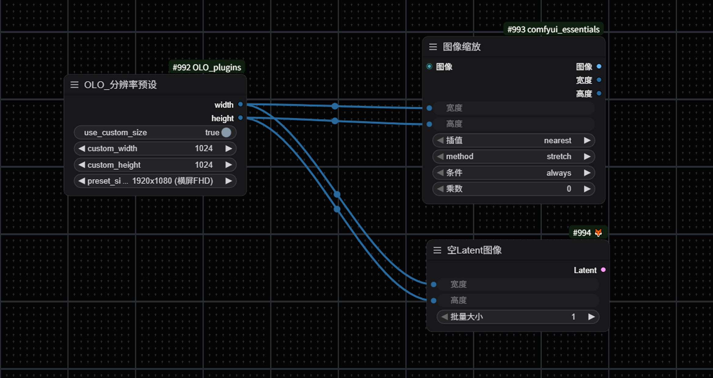
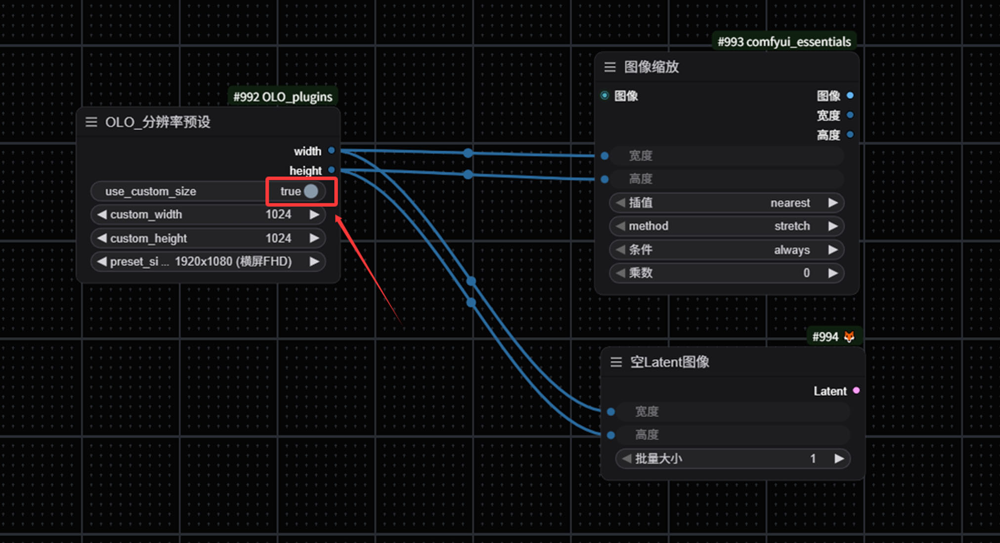
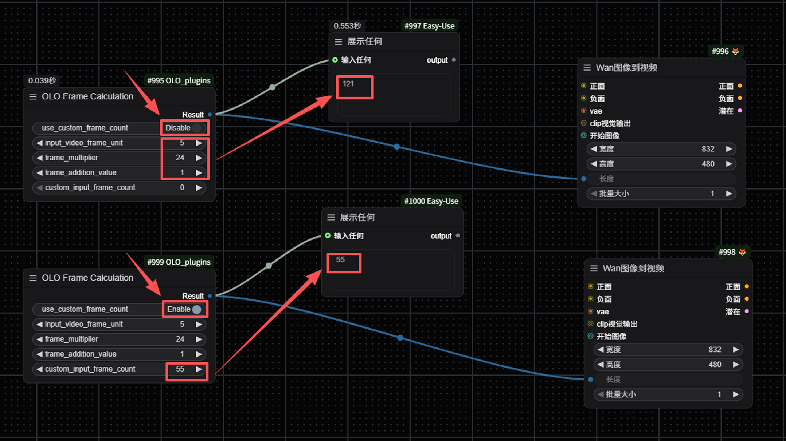
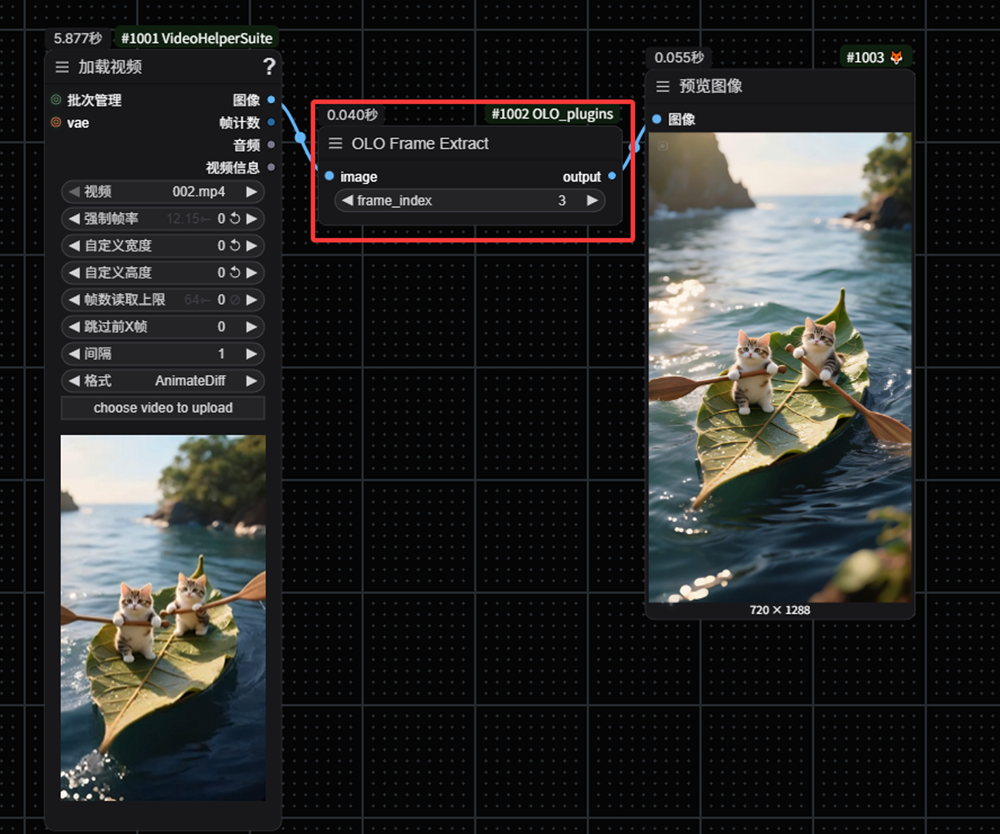

Installation
节点安装：

cd ComfyUI/custom_nodes

git clone https://github.com/javonLim/ComfyUI-OLO_plugins.git

OLO_ModelShare：模型共享功能

### 功能介绍

OLO_ModelShare 是一个模型共享功能，允许在不同的 ComfyUI 实例之间共享模型文件，支持两种共享模式：

1. **merge 模式**：保持现有 ComfyUI 目录下的模型文件和外部模型文件的当前存储位置，通过创建符号链接的方式实现虚拟共存
2. **move 模式**：将现有 ComfyUI 目录下的模型文件全部移动到外部模型目录，然后通过虚拟目录访问外部文件夹中的模型

### 配置方法

1. 配置文件路径：`ComfyUI/custom_nodes/ComfyUI-OLO_plugins/shared_config.conf`
2. 主要配置选项：
   - `enable`：是否启用模型共享功能，默认为 `true`
   - `share_mode`：共享模式，可选值为 `merge` 或 `move`，默认为 `merge`
   - `ext_models_path`：外部模型目录路径，需要替换为实际路径
   - `log_level`：日志级别，可选值为 `DEBUG`、`INFO`、`WARNING`、`ERROR`、`CRITICAL`，默认为 `INFO`

### 配置示例

```ini
[share_model]
enable = true
share_mode = merge
ext_models_path = H:\ComfyUI_external\models
log_level = WARNING
```

### 使用说明

1. 确保外部模型目录存在且包含有效的模型文件
2. 编辑 `shared_config.conf` 文件，配置合适的参数
3. 启动 ComfyUI，模型共享功能会自动运行
4. 查看日志输出，确认模型共享是否成功

### 日志查看

- 日志会输出到 ComfyUI 的控制台
- 可以通过调整 `log_level` 来控制日志详细程度
- 成功运行后会显示统计信息，包括成功创建的符号链接数量、跳过的文件数量等

### 注意事项

1. 在 Windows 系统上，创建符号链接需要管理员权限或开启开发者模式
2. 建议先备份重要模型文件，再使用 `move` 模式
3. 定期检查配置文件，确保外部模型目录路径正确
4. 可以通过修改配置文件中的 `enable` 选项来临时禁用该功能

### 功能特点

- 支持多种配置文件路径，方便不同环境下的使用
- 自动创建默认配置文件，简化配置过程
- 详细的日志记录，便于调试和监控
- 支持两种共享模式，满足不同场景需求
- 与 OLO 插件体系无缝集成，无需额外安装

### 自定义节点的使用

Let's start introducing the use of custom nodes:
让我们开始介绍自定义节点的使用：

#### OLO_ResolutionPreset:图像分辨率预设



Commonly used, image zoom, mask zoom, video zoom.
常用的有图像缩放、蒙版缩放、视频缩放。



It is possible to customise the input resolution, but be careful to tick Use Custom.
可以自定义输入分辨率，但请注意勾选“使用自定义”。

#### OLO_WanFrame:万相帧运算



For the commonly used multiples of 4+1 in WAN, 4 can be left unchanged and only the frame multiplier needs to be modified. You can also select 'Enable' to customize the input frame rate.
针对 wan 常用的 4 的倍数+1，4 可以不动只需要修改帧倍数就可以了。也可以勾选启用，自定义输入帧数。

#### OLO_FrameHold：视频关键帧提取



Extract keyframes from the video, customize the number of frames to be extracted, and directly obtain the corresponding static image.
提取视频中的关键帧，自定义输入想要提取的帧数，直接得到对应的静态图像。

#### OLO_LastFrame：提取最后一帧

该节点用于从视频帧序列中提取最后一帧，适用于需要获取视频结尾帧进行进一步处理的场景。

**主要功能**：

- 自动识别视频帧序列中的最后一帧
- 支持自定义文件名生成
- 包含完善的错误处理机制
- 可配置出错时是否返回第一帧作为备选

**输入参数**：

- `image`：视频帧序列（IMAGE 类型）
- `return_first_on_error`：出错时是否返回第一帧作为备选（BOOLEAN 类型，默认值为 True）
- `last_frame_name`：自定义文件名前缀（STRING 类型，可选，默认值为"last*frame*"）

**输出结果**：

- `last_frame`：提取的最后一帧图像（IMAGE 类型）
- `filename`：生成的自定义文件名（STRING 类型）

**使用说明**：

1. 将视频帧序列连接到`image`输入
2. 根据需要配置`return_first_on_error`选项
3. 可选择性地输入自定义文件名前缀
4. 输出的`last_frame`可直接用于后续处理
5. 输出的`filename`可用于保存图像时的命名

#### OLO_FirstLastFrame：提取首尾帧

该节点用于从视频帧序列中同时提取第一帧和最后一帧，适用于需要对比视频开始和结束状态的场景。

**主要功能**：

- 同时提取视频的第一帧和最后一帧
- 支持自定义文件名生成
- 包含完善的错误处理机制
- 可配置出错时是否返回第一帧作为备选

**输入参数**：

- `image`：视频帧序列（IMAGE 类型）
- `return_first_on_error`：出错时是否返回第一帧作为备选（BOOLEAN 类型，默认值为 True）
- `video_name`：自定义文件名前缀（STRING 类型，可选，默认值为"video\_"）

**输出结果**：

- `first_frame`：提取的第一帧图像（IMAGE 类型）
- `last_frame`：提取的最后一帧图像（IMAGE 类型）
- `first_frame_name`：第一帧的自定义文件名（STRING 类型）
- `last_frame_name`：最后一帧的自定义文件名（STRING 类型）

**使用说明**：

1. 将视频帧序列连接到`image`输入
2. 根据需要配置`return_first_on_error`选项
3. 可选择性地输入自定义文件名前缀
4. 输出的`first_frame`和`last_frame`可直接用于后续处理或对比
5. 输出的文件名可用于保存图像时的命名

**应用场景**：

- 视频首尾帧对比
- 视频缩略图生成
- 视频开始和结束状态分析
- 动画序列的关键帧提取

#### OLO_AudioConcat：音频拼接

该节点用于拼接多个音频文件，并支持添加静音间隔和静音控制。

**主要功能**：

- 支持最多 5 个音频文件的拼接
- 可添加开始、中间和结束静音间隔
- 支持为每个音频单独设置静音状态
- 自动处理采样率匹配
- 完善的错误处理机制

**输入参数**：

- `audio1`：第一个音频文件（AUDIO 类型，必填）
- `audio2`：第二个音频文件（AUDIO 类型，必填）
- `audio3`：第三个音频文件（AUDIO 类型，可选）
- `audio4`：第四个音频文件（AUDIO 类型，可选）
- `audio5`：第五个音频文件（AUDIO 类型，可选）
- `mute1`：是否静音第一个音频（BOOLEAN 类型，默认值为 False）
- `mute2`：是否静音第二个音频（BOOLEAN 类型，默认值为 False）
- `mute3`：是否静音第三个音频（BOOLEAN 类型，默认值为 False）
- `mute4`：是否静音第四个音频（BOOLEAN 类型，默认值为 False）
- `mute5`：是否静音第五个音频（BOOLEAN 类型，默认值为 False）
- `start_spacer`：开始静音间隔时长（FLOAT 类型，单位：秒，默认值为 0.0，范围：0.0-5.0，步长：0.1）
- `middle_spacer`：音频之间的静音间隔时长（FLOAT 类型，单位：秒，默认值为 0.0，范围：0.0-5.0，步长：0.1）
- `end_spacer`：结束静音间隔时长（FLOAT 类型，单位：秒，默认值为 0.0，范围：0.0-5.0，步长：0.1）

**输出结果**：

- `concatenated_audio`：拼接后的音频文件（AUDIO 类型）

**使用说明**：

1. 将第一个音频文件连接到`audio1`输入
2. 将第二个音频文件连接到`audio2`输入
3. 可选地将第三个音频文件连接到`audio3`输入
4. 可选地将第四个音频文件连接到`audio4`输入
5. 可选地将第五个音频文件连接到`audio5`输入
6. 根据需要为每个音频设置静音状态
7. 设置开始、中间和结束的静音间隔时长
8. 输出的`concatenated_audio`可直接用于后续处理或保存

**应用场景**：

- 多个音频片段拼接
- 音频过渡效果制作
- 多轨音频混合
- 音频静音处理
- 音频间隔调整
- 音频序列组合
- 背景音乐与音效混合
- 语音片段拼接

#### OLO_AudioInfo：音频信息查看

该节点用于查看音频文件的详细信息，包括采样率、时长、通道数、样本数等。

**主要功能**：

- 显示音频的采样率
- 显示音频的时长
- 显示音频的通道数
- 显示音频的样本数
- 显示音频的数据类型
- 显示音频的设备信息
- 显示音频的最小值
- 显示音频的最大值
- 显示音频的平均值
- 显示音频的标准差
- 显示音频的批次大小

**输入参数**：

- `audio`：音频文件（AUDIO 类型，必填）

**输出结果**：

- `audio_info_string`：音频信息字符串（STRING 类型）

**使用说明**：

1. 将音频文件连接到`audio`输入
2. 执行节点，音频信息将显示在节点的 UI 中
3. 输出的`audio_info_string`可用于后续处理或保存

**应用场景**：

- 音频文件信息查看
- 音频属性分析
- 音频处理前的信息确认
- 音频调试和故障排除
- 音频格式验证
- 音频质量评估

#### OLO_Code：Python 代码执行

该节点允许用户在 ComfyUI 中直接执行自定义 Python 代码，支持动态输入输出端口和安全沙箱机制。

**主要功能**：

- 支持直接输入代码或从文件加载
- 提供安全沙箱，限制代码执行权限
- 支持超时机制，防止无限循环
- 提供丰富的内置函数和模块
- 支持高度自定义的动态输入端口数量（1-100）
- 支持高度自定义的动态输出端口数量（1-8）
- 支持单输出模式和多输出模式
- 提供详细的错误信息
- 支持代码缓存，提高执行效率
- 自动更新端口数量，无需手动操作

**输入参数**：

- `code_input`：要执行的 Python 代码，使用 inputs、output 和 outputs 变量进行输入输出
- `inputcount`：输入端口数量，范围 1-100，决定显示多少个输入端口
- `outputcount`：输出端口数量，范围 1-8，决定显示多少个输出端口
- `timeout`：代码执行超时时间(秒)，防止代码无限运行
- `file`：从文件加载代码的路径，优先级高于 code_input
- `use_file`：是否使用文件中的代码
- `run_always`：是否总是运行，忽略缓存
- `enable_sandbox`：是否启用安全沙箱，限制代码执行权限
- `in0-inN`：动态输入端口，数量由 inputcount 决定，N 为 inputcount-1

**输出参数**：

- `output_0-output_N`：代码执行结果，数量由 outputcount 决定，N 为 outputcount-1
  - 单输出模式：通过 output 变量赋值，结果会输出到 output_0
  - 多输出模式：通过 outputs 字典赋值，例如 outputs[0] = '结果1'，outputs[1] = '结果2'

**代码变量说明**：

- `inputs`：输入字典，包含所有输入端口的值
  - 通过 inputs['in0']或 inputs[0]访问第一个输入端口
  - 通过 inputs['in1']或 inputs[1]访问第二个输入端口，依此类推
- `output`：单输出变量，直接赋值即可，例如：output = '结果'，结果会输出到 output_0
- `outputs`：多输出字典，通过索引赋值，例如：outputs[0] = '结果1'，outputs[1] = '结果2'
- `print`：自定义打印函数，输出到控制台
- `time`：time 模块，用于时间相关操作

**安全沙箱**：

- 启用时，只允许使用白名单中的内置函数和模块
- 禁用时，可以使用所有 Python 功能（不安全）
- 白名单模块包括：math, random, datetime, json, re, os.path, string

**使用示例**：

1. 简单输出（单输出模式）：

```python
output = 'hello, world!'  # 结果会输出到 output_0
```

2. 使用输入端口（单输出模式）：

```python
output = inputs.get('in0', '默认值')  # 结果会输出到 output_0
```

3. 计算（单输出模式）：

```python
num1 = inputs.get('in0', 0)
num2 = inputs.get('in1', 0)
output = num1 + num2  # 结果会输出到 output_0
```

4. 多输出模式：

```python
# 确保 outputcount 参数设置为至少 3
outputs[0] = 'first output'  # 结果会输出到 output_0
outputs[1] = 42  # 结果会输出到 output_1
outputs[2] = [1, 2, 3]  # 结果会输出到 output_2
```

5. 混合输出模式：

```python
# 确保 outputcount 参数设置为至少 2
output = 'main output'  # 结果会输出到 output_0
outputs[1] = 'secondary output'  # 结果会输出到 output_1
```

6. 使用内置模块：

```python
import math
num = inputs.get('in0', 1)
output = math.sqrt(num)  # 结果会输出到 output_0
```

**使用说明**：

1. 在 code_input 文本框中输入 Python 代码
2. 调整 inputcount 参数设置输入端口数量（自动更新）
3. 调整 outputcount 参数设置输出端口数量（自动更新）
4. 可选地从文件加载代码
5. 配置安全沙箱和超时设置
6. 连接输入端口
7. 执行节点，结果将输出到对应数量的输出端口

**安全注意事项**：

- 避免执行未知来源的代码
- 启用安全沙箱可以防止恶意代码执行
- 设置合理的超时时间，防止无限循环
- 不要在代码中尝试访问敏感资源

**应用场景**：

- 自定义数据处理
- 数学计算和转换
- 字符串处理和格式化
- 数据可视化和分析
- 自定义算法实现
- 集成外部 Python 库（需关闭安全沙箱）
- 快速原型开发
- 需要多个输出结果的复杂处理场景
- 动态生成多个结果的场景

#### OLO_DrawPoseKeypoint：绘制姿态关键点

该节点用于绘制姿态关键点，支持 body 和 wholebody 两种关键点方案，可调整置信度阈值和线条粗细。

**主要功能**：

- 支持 body（17 点）和 wholebody（134 点）两种关键点方案
- 可调整置信度阈值，过滤低置信度关键点
- 支持根据图像大小自动调整线条粗细
- 可选择绘制单个人或所有人
- 支持在基础图像上叠加绘制
- 可调整叠加透明度

**输入参数**：

- `pose_keypoint`：姿态关键点数据（POSE_KEYPOINT 类型，必填）
- `score_threshold`：置信度阈值（FLOAT 类型，默认值为 0.3，范围：0.0-1.0，步长：0.01）
- `scale_for_xinsr`：是否根据图像大小调整线条粗细（BOOLEAN 类型，默认值为 False）
- `keypoint_scheme`：关键点方案（选项：body, wholebody，默认值为 wholebody）
- `draw_all_people`：是否绘制所有人（BOOLEAN 类型，默认值为 True）
- `base_image`：基础图像（IMAGE 类型，可选）
- `overlay_alpha`：叠加透明度（FLOAT 类型，默认值为 1.0，范围：0.0-1.0，步长：0.05）

**输出结果**：

- `images`：绘制了姿态关键点的图像（IMAGE 类型）

**使用说明**：

1. 将姿态关键点数据连接到`pose_keypoint`输入
2. 根据需要调整置信度阈值和关键点方案
3. 可选地连接基础图像进行叠加绘制
4. 执行节点，将生成绘制了姿态关键点的图像

**应用场景**：

- 姿态估计结果可视化
- 姿态关键点调试和分析
- 人体姿态教学和演示
- 动画和游戏开发中的姿态参考

#### OLO_KeypointSelector：关键点帧选择器

该节点用于选择和处理姿态关键点帧，支持帧索引选择和帧重写功能。

**主要功能**：

- 支持从多帧姿态数据中选择特定帧
- 支持重写特定帧的姿态数据
- 自动处理不同格式的姿态关键点输入
- 确保输出数据格式统一

**输入参数**：

- `pose_keypoint`：姿态关键点数据（POSE_KEYPOINT 类型，必填）
- `frame_index`：要选择的帧索引（INT 类型，默认值为 0，最小值：0，步长：1）
- `frame_index_rewrite`：要重写的帧索引（INT 类型，默认值为 0，最小值：0，步长：1）
- `keypoint_frame_rewrite`：用于重写的关键点帧数据（POSE_KEYPOINT 类型，可选）

**输出结果**：

- `pose_keypoint_updated`：更新后的姿态关键点数据（POSE_KEYPOINT 类型）
- `pose_keypoint_single`：单帧姿态关键点数据（POSE_KEYPOINT 类型）
- `selected_frame_index`：选中的帧索引（INT 类型）

**使用说明**：

1. 将多帧姿态关键点数据连接到`pose_keypoint`输入
2. 设置要选择的帧索引`frame_index`
3. 可选地设置要重写的帧索引和重写数据
4. 执行节点，将生成更新后的姿态数据和选中的单帧数据

**应用场景**：

- 多帧姿态数据处理
- 姿态动画关键帧选择
- 姿态数据修复和编辑
- 姿态序列分析和研究
